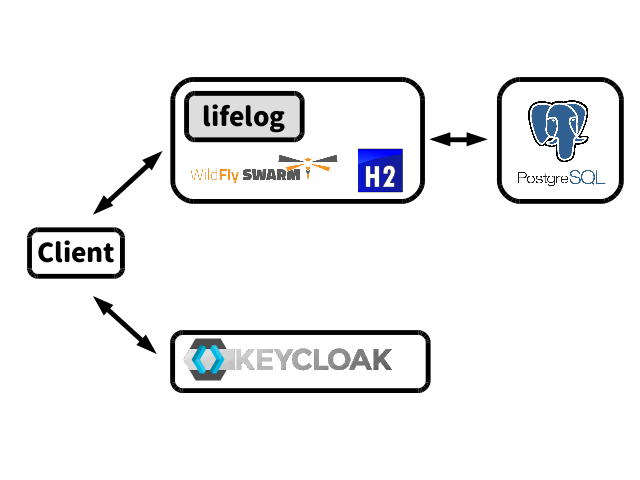

# アプリケーション構成概要

今回作成するアプリケーションと、関連するミドルウェアを合わせた全体図は以下のようになります。

作成するアプリケーションは `lifelog` という名前の Java EE アプリケーションであり、WildFly Swarm を利用して ubar jar としてビルドします。

この lifelog は RDB を用いますが、H2(インメモリ) と PostgreSQL のどちらを利用するかを起動時に決定します。

また、特定の API に対して、Keycloak というミドルウェアを用いて認証をかけます。

それでは次章から少しずつアプリケーションを作っていきましょう!
