# 付録 Keycloak の設定

ここでは lifelog の認証に用いる Keycloak の設定を説明します。

> なお、今回の設定は以下を元にしています。
>
> [Getting started with Keycloak - Securing a REST Service](http://blog.keycloak.org/2015/10/getting-started-with-keycloak-securing.html)

## Keycloak Server の起動

まずは本編と同様、KeyCloak Server の Docker コンテナを起動します。

<pre><code class="lang-sh">$ docker run -it -d \
  --name lifelog-auth-tmp \
  -p 18080:8080 \
  -e KEYCLOAK_USER=admin -e KEYCLOAK_PASSWORD=admin \
  jboss/keycloak:{{book.versions.keycloak}}
</code></pre>

以下を実行するとコンテナ内のログの内容が確認できます。

``` sh
$ docker logs -f lifelog-auth-tmp
```

以下のようなログが表示されていれば起動できています。

<pre><code class="lang-sh">WFLYSRV0025: Keycloak {{book.versions.keycloak}} ...
</code></pre>

## Keycloak Server へのログイン

Keycloak Server が起動したら http://localhost:18080/auth/ にアクセスします。

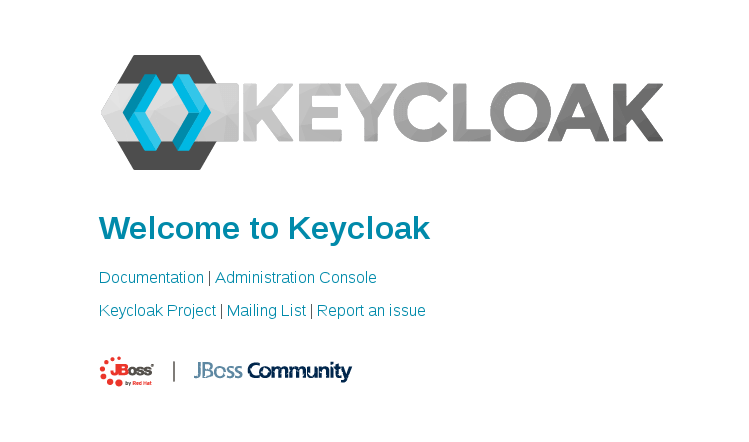

Administration Console をクリックするとログイン画面に移動します。Username/Password にそれぞれ admin/admin と入力し、Login ボタンをクリックします。

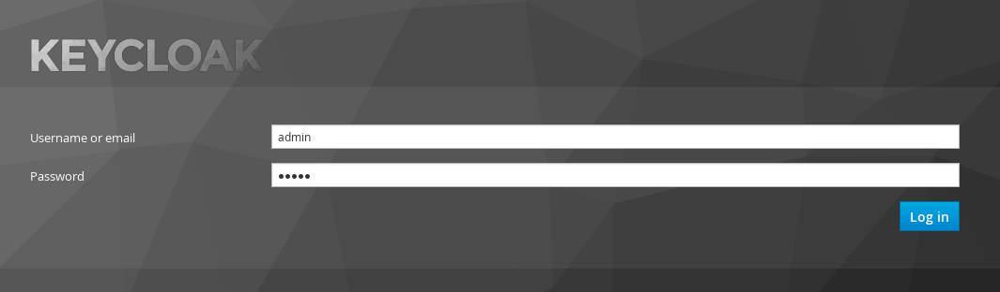

## lifelog Realm の作成

Keycloak では Realm という単位で認証に対応するアプリケーションとユーザを管理します。ここでは lifelog Realm を作成します。

ログイン後、左上の Master と記載されているところにカーソルを合わせると出てくる Add realm ボタンをクリックします。

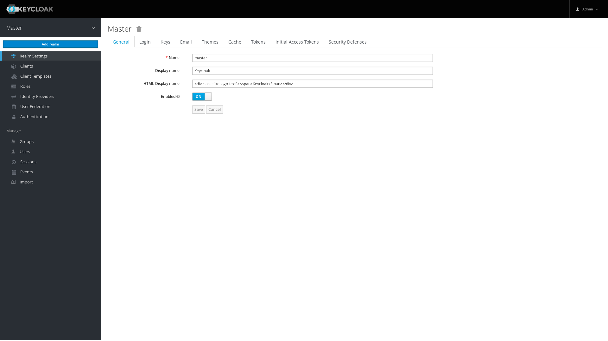

Name に `lifelog` と入力し、Create をクリックします。

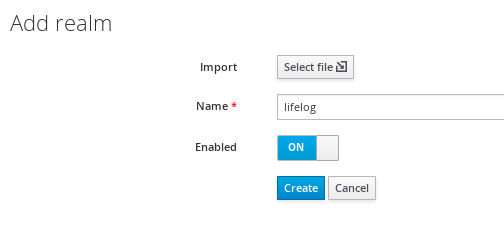

## クライアントの設定

lifelog Realm を利用するアプリケーション、つまり Keycloak Server に対するクライアントの設定を行います。

### lifelog

まず lifelog アプリケーションのクライアント設定を行います。

左のメニューから Clients をクリックし、右上の Create ボタンをクリックします。

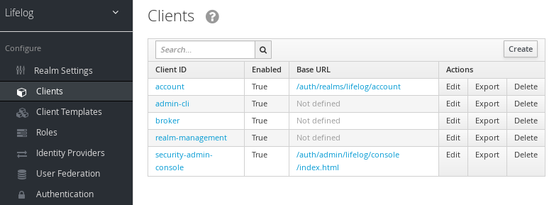

Client ID に `lifelog` と入力し、Save をクリックします。

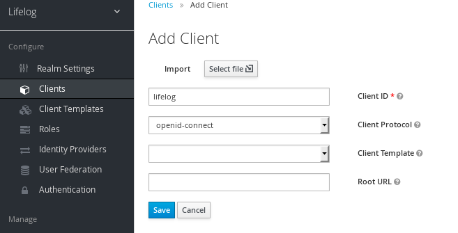

Settings の画面に移動するので Access Type に bearer-only を指定して Save をクリックします。

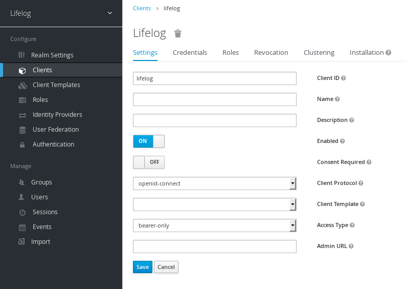

> bearer-only を指定したクライアントは bearer トークンのみ認証に利用し、自身はトークンを取得できません。よってこのクライントは Keycloak Server にログインするためにユーザをリダイレクトさせることもしません。lifelog アプリケーションは実際は別のアプリケーション(UI など)から実行されることを想定していてユーザが直接触れるものではないので bearer-only がちょうどいい Access Type です。

### lifelog の keycloak.json をアプリケーションに配置

lifelog のクライント設定ファイルである keycloak.json を取得します。Installation をクリックし、Format Option を Keycloak OIDC JSON に選択し、Downlaod をクリックします。ダウンロードした keycloak.json は src/main/resources に配置します(すでに存在する場合は上書き)。

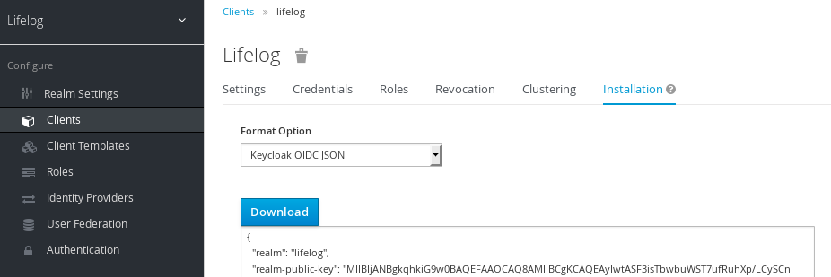

### curl

lifelog は bearer-only であるため、トークンを取得するなんらかのクライアントが別に必要です。本来は UI アプリケーションなどになりますが、まだ用意していないので curl を利用することにします。さきほどと同様に Clients -> Create と進み、Client ID に curl と入力したうえで Save をクリックします。

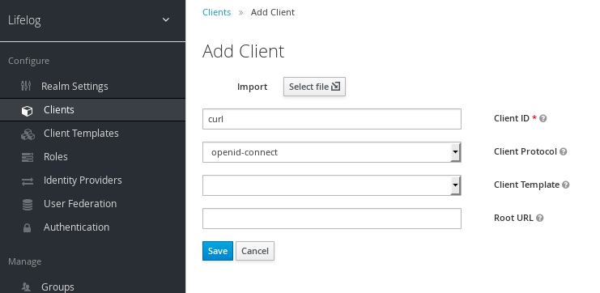

Valid Redirect URIs に `http://localhost` と入力し、Save をクリックします。

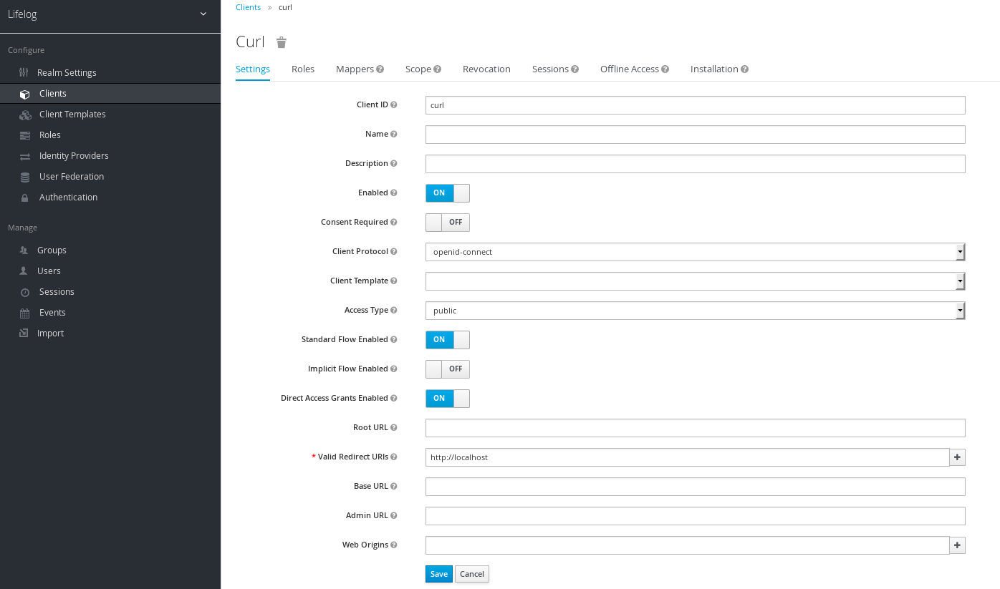

## Role の設定

次に認可に利用する Role を作成します。左のメニューから Roles をクリックし、右の Add Role をクリックします。

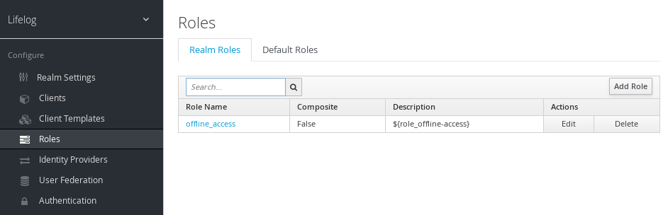

Role Name に `author` と入力し、Save をクリックします。

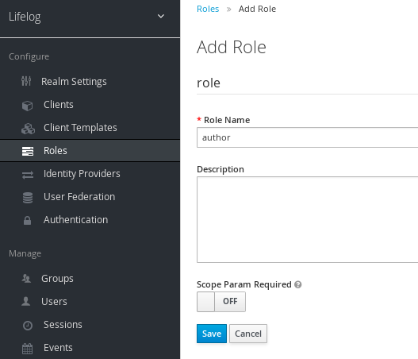

## User の設定

`author` ロールを持つ User を作成します。左のメニューから Users をクリックし、右の Add user をクリックします。

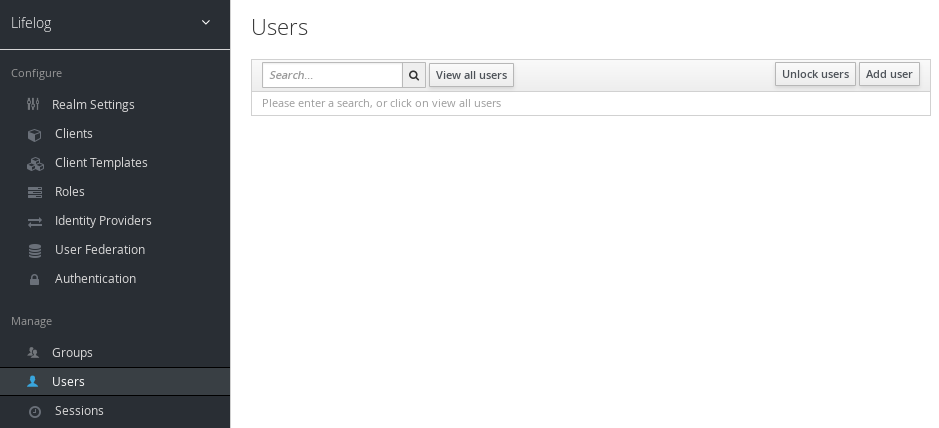

Username に `user1` と入力し、Save をクリックします。

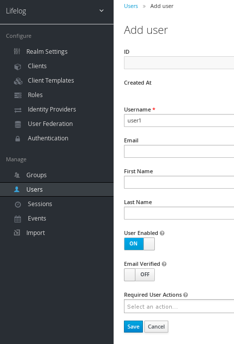

次に、パスワード変更のため、Credentials をクリックします。

New Password と Password Confirmation それぞれに `password1` と入力後、Reset Password をクリックします。その後表示されるダイアログも Change Password をクリックします。なお、Temporary は OFF にしておいてください。

> Temporary が ON の場合、初回ログイン時にパスワードをリセットする必要があります。

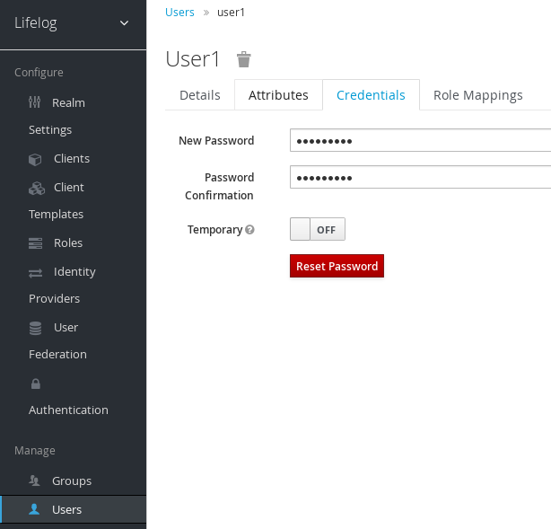

次に、`user1` に `author` ロールを設定するため、Role Mappings をクリックします。

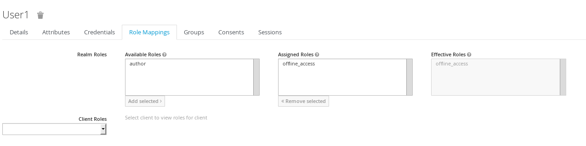

Available Roles から author を選択し、Add selected をクリックします。

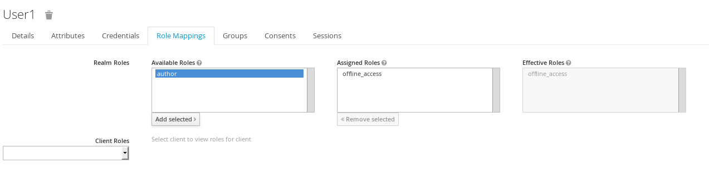

Assigned Roles に author が追加されます。

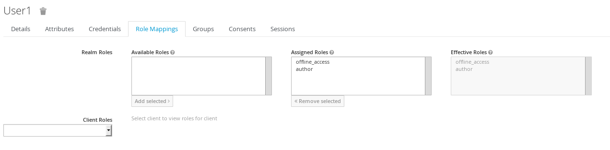

## 設定のエクスポート

ここまでで一通り設定が完了したので、いつでもこの設定が使えるようにファイルとしてエクスポートしておきます。

以下コマンドで起動中のコンテナに対して bash を実行できます。

``` sh
$ docker exec -it lifelog-auth-tmp /bin/bash
```

コンテナ上の bash が起動したら以下を実施します。

``` sh
[in-container]
$ /opt/jboss/keycloak/bin/standalone.sh -Djboss.socket.binding.port-offset=100 \
  -Dkeycloak.migration.action=export -Dkeycloak.migration.provider=singleFile -Dkeycloak.migration.file=/tmp/my-lifelog.json
```

> 設定ファイルのエクスポートに Keyclaok Server の起動が必要なので、上記のようになっています。

`WFLYSRV0025: Keycloak ...` と表示されたら Ctrl - C で Keycloak Server を停止します。ここまでできたら Ctrl-D でコンテナから抜けます。

コンテナの /tmp 以下に `my-lifelog.json` というファイルができていますので、ホストから取得します(/path/to は適当に読み替え)。

``` sh
$ docker cp lifelog-auth-tmp:/tmp/my-lifelog.json /path/to/my-lifelog.json
```

ここまでできたらこのコンテナは不要なので、削除しておきます。

``` sh
$ docker rm -f lifelog-auth-tmp
```

本編で Keycloak Server を起動する場合は、この my-lifelog.json を利用するようにします。

<pre><code class="lang-sh">$ docker run -it -d \
  --name lifelog-auth \
  -p 18080:8080 \
  -v /path/to:/tmp/lifelog-auth \
  jboss/keycloak:{{book.versions.keycloak}} \
  -b 0.0.0.0 -Dkeycloak.migration.action=import -Dkeycloak.migration.provider=singleFile -Dkeycloak.migration.file=/tmp/lifelog-auth/my-lifelog.json
</code></pre>
